实验一：在Zynq FPGA上实现LeNet网络实验报告
==========================================
2018年12月

设计思路
--------

### 整体架构

考虑到LeNet的层次特点，将相关计算单元进行了整合。集中设计了统一的一个计算模块及数据加载模块以减少LUT和DSP资源的使用，同时将bram循环使用减少bram空间资源的消耗。形成了目前的整体设计框架图，其中，控制器部分采用多个状态机进行计算流程控制，并通过中断信号与PS端完成相应。数据传输有AXI总线协议直接针对bram进行数据读写。

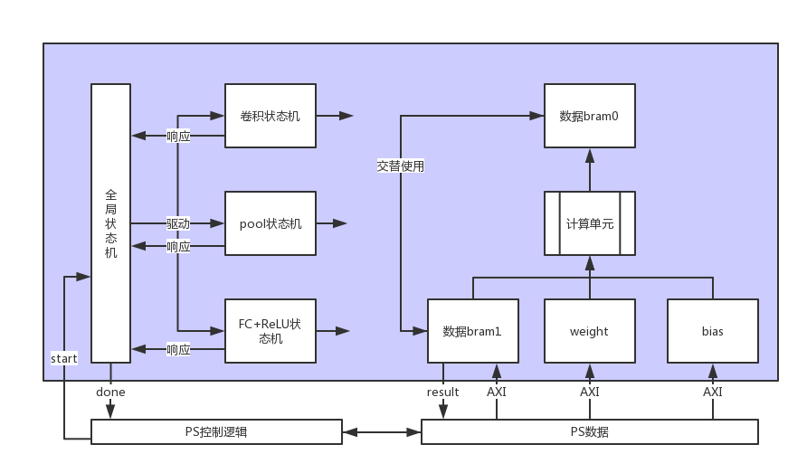

Figure 1：整体设计框架

如Figure 1所示，PL设计主要分为两部分——控制器和计算通路，这样做虽然不能流水或并行处理多张图片，但好处就是保证了片上运算资源的最大程度的利用。

功能实现
--------

### 计算通路设计

针对计算数据的初步分析如下：

表格 1：卷积计算分析

| 层次  | 卷积大小 | 通道数 | 卷积计算次数 |
|-------|----------|--------|--------------|
| Conv1 | 5\*5     | 1      | 20           |
| Conv2 | 5\*5     | 20     | 50           |

表格 2：全连接计算分析

| 层次 | 单次计算大小 | 计算次数 |
|------|--------------|----------|
| FC1  | 800\*500     | 500      |
| FC2  | 500\*500     | 10       |

通过以上分析，可以设计出一个通用的乘加器设计，规格如下：

表格 3：乘加器规格

| 端口名称 | 方向 | 格式              | 说明           |
|----------|------|-------------------|----------------|
| data     | I    | [5\*5\*20\*8-1:0] | 第一组数据输入 |
| weight   | I    | [5\*5\*20\*8-1:0] | 第二组数据输入 |
| bias     | I    | [20\*8-1:0]       | bias输入       |
| result   | O    | [15:0]            | 乘加结果输出   |

综合计算分析，希望能够提取出乘加计算中最大的相似部分使得乘加资源能够利用，因此我将乘加计算单元划分为5\*5\*20的8位乘加器作为核心模块，这样的模块设计在每层的复用情况如下：

表格 4：乘加器复用情况

| 层次  | 复用说明                                                   |
|-------|------------------------------------------------------------|
| Conv1 | 20个卷积核一次性读入，每次只需更换图像数据，卷积核完全复用 |
| Conv2 | 单个卷积核一次load完成全部计算，卷积核完全复用             |
| FC1   | 由于数据不对齐，放弃复用设计                               |
| FC2   | data一次load，每次更换权重矩阵的列，data数据完全复用       |

需要说明的是，针对FC1的数据格式（800\*800）因为现有的乘加器满足的是500\*500的运算，所以只能采用切割的方式（500+300）完成一次乘加运算。这样做虽然有些浪费缓存资源，但却是在不增加计算单元的前提下的最佳实现思路。7020片上DSP资源只有220个，因此针对500\*500的计算规模，依旧有部分计算式超出DSP资源限制的，需要使用LUT实现乘法器来弥补这部分的不足，这个问题也是在设计迭代中的折中办法。

### 全局控制状态机

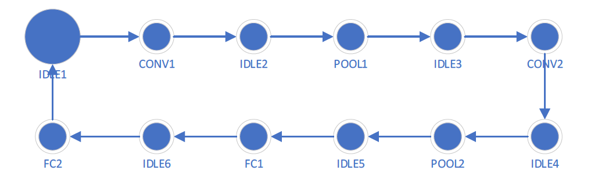

Figure 2：全局状态机

由于每层权重数据都需要通过PS的AXI总线进行数据传输，因此在原有的状态机基础上增加了多个IDLE状态来等待上位机数据写入完成，这里的每一个状态IDLE转出的控制条件都为start信号为高电平，转入条件为done信号位低电平。为了保证start信号不被重复接收（PS端和PL端存在读写延迟），增加了retain控制信号来保留输出并和start信号一起完成信号控制。时序协议见Figure 3。

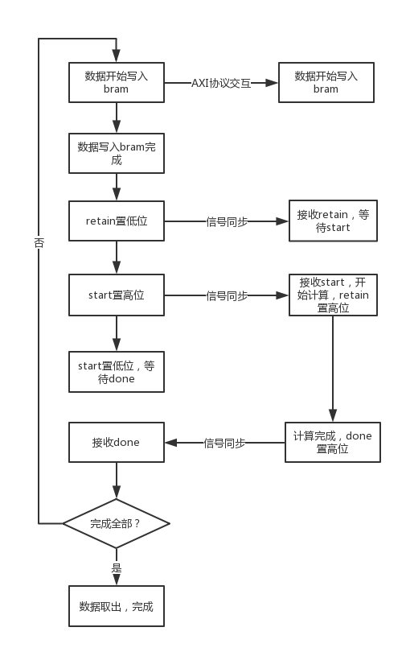

Figure 3：通信控制协议

### 卷积计算子状态机

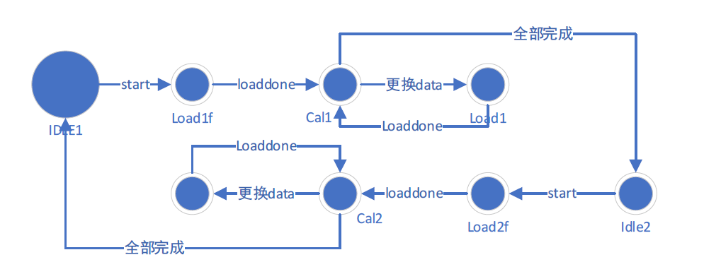

Figure 4：卷积状态机

卷积计算的状态控制集合了两个卷积层的计算过程，因为两个卷积层除了尺寸稍有区别，其他的过程完全一致，所以可以整合成统一的状态控制进行，卷积层之间虽然插入了pool层，但可以通过start信号的控制以及数据buffer的分选来实现在一个状态机中完成两层卷积的计算流程控制。

### Pool计算子状态机

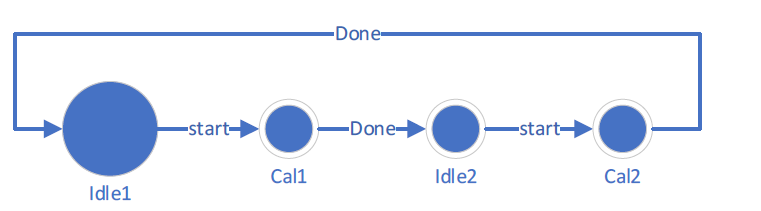

Figure 5：pool子状态机

Pool层实现起来比较简单，利用数据顺序存储的特点，只需要顺序读取并保留相应的位置上的最大值即可，因此状态设计也比较简单，同样将两个pool过程整合到了同一个状态机中，通过统一的start信号进行控制，分选器控制bram数据读取与写入的位置。

### FC子状态机

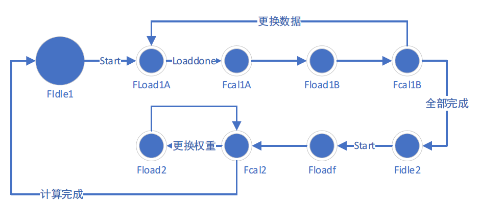

Figure 6：FC子状态机

继续沿用前几部分的设计思路，将两部分全连接计算状态机整合为统一的状态机整体。这里针对各个状态给出相应的解释，见表格
5。

表格 5：FC状态说明

| 部分状态 | 说明                                     |
|----------|------------------------------------------|
| FLoad1A  | 长度800的向量中前500，第一部分的数据load |
| Fcal1A   | 同上，计算这500\*500的数据               |
| Fload1B  | 长度为800的向量中后300，第二部分数据load |
| FCal1B   | 同上，计算着300\*300的数据               |
| Floadf   | FC2中同时load data和weight、bias         |
| FCal2    | 计算FC2的乘加                            |
| FLoad2   | data复用，只load weight和bias数据        |

FC层的实现中直接加入了ReLU函数，因为ReLU函数的功能就是保留所有的整数，负数置零，这部分并不需要单独的模块，只需要在FC数据的计算出口进行简单的判断即可，因此设计中并未出现单独的ReLU模块，而是集成的FC+ReLU模块。

问题与分析
----------

### 遇到的问题

实现过程中，虽然考虑了bram的复用，但对于数据buffer因为数据格式不同并未实现复用设计，在这样的思路上，第一版实现中综合之后的资源情况见Figure 7。

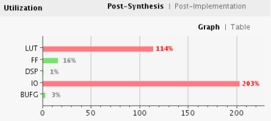

Figure 7：LUT超过限制

之后修改了dataloader的格式，在dataloader的信号部分增加了模式选择，并将不同计算层的dataloader状态机合并，得到了现在的dataloader。这样的设计可以使得buffer得到完全的复用从而减少资源的消耗，优化之后的资源利用情况为见Figure 8。

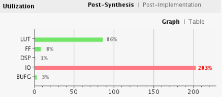

Figure 8：优化LUT

新整合的dataloader文件内有两个模块，一个Data\_loader模块用来装载卷积和FC的数据，一个Weight\_loader模块用来装载各层的参数，因为data和weight的复用情况不同所以这两部分分开设计，方便分别调用控制开启。Loader的状态转移逻辑较为简单，这里主要介绍一下状态的功能。

表格 6：dataloader状态说明

| 部分状态     | 说明                                 |
|--------------|--------------------------------------|
| Idle         | 初始状态                             |
| Idle\_m       | FC层load 500到load 300的过渡wait状态 |
| C\_DataLoad1  | 卷积层1数据加载                      |
| C\_DataLoad2  | 卷积层2数据加载                      |
| F\_DataLoad15 | FC层1 500数据加载                    |
| F\_DataLoad13 | FC层1 300数据加载                    |
| F\_DataLoad2  | FC层2数据加载                        |
| Done\_m       | FC层load 500到load 300的过渡done状态 |
| Done         | 完成done状态                         |

具体实现方面，数据的加载模式采用了移位load的方式进行数据加载，即每次load
bram中指定位宽的数据并进行移位，下一次再load相同位宽的数据，知道load完全部的数据。

### DSP资源不足

在分析资源利用时，由于一开始对各项资源了解不深刻，并没有意识到DSP资源的问题。后来发现，直接使用乘法运算符时Vivado并不会综合处DSP设计，只有显式调用乘法器IP核才能实现DSP资源的利用，但使用IP综合的资源利用分析在主页面中不会计算，只有单独调用利用率分析报告才会计算包括IP的资源使用情况。正如前文分析，本设计中的乘加器需要并行完成500个8\*8bits的乘法，现有的DSP资源显然是不够的，因此我尝试了使用部分DSP，部分LUT的实现方案。资源利用情况见Figure 9。

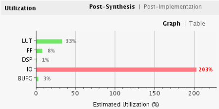

Figure 9：DSP+LUT

使用DSP的前提下，对LUT资源还是比较友好的，但仿真时时序问题总是无法调整好，鉴于原初全部使用LUT设计的资源可以满足要求，因此最终的实现方式中并未采用DSP的乘法器实现方案。

### Bram读写冲突

在pool层的设计中，需要完成对bram同一位置的读写操作，进行这一操作时，Vivado给出了警告：

>A read was performed on address d9ff (hex) of port B while a write was requested
>to the same address on port A. The write will be successful however the read
>value on port B is unknown until the next CLKB cycle.

但现有的pool实现逻辑中对同一位置的交叉读写访问时不可避免的，因此我才用了改变时钟周期的方式缓解了这个问题，现有的波形图见Figure10。

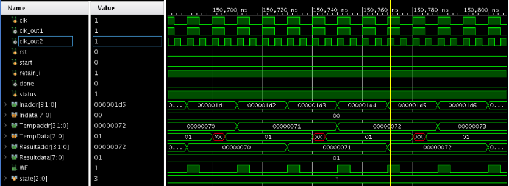

Figure 10：冲突波形

可见虽然还是有读写冲突存在，但在需要数据的时候数据值已经到达了稳定状态，因此并不影响正常的数据计算。

结果与验证
----------

目前本设计的计算与控制模块的Verilog代码已经完成，而且集成了响应大小的bram完成了sim仿真文件的编制，处在仿真验证阶段，数据可以正常传输并正确计算至两层卷积计算完毕。从仿真结果来看，设计中的数据通路和状态机功能表现正确。但因为完成卷积的仿真时间较长，需要超过200万周期才能到达卷积层的出口进入全连接层，因此这部分的设计验证工作还未完全完成。

对于block
design的设计，按照现有的bram互联方式连接即可，只需要将部分模块从但接口改成dual
port并设计另外一端为AXI总线接口实现与PS端的数据交互即可。

关于PS的软件设计，也是状态机的形式，转换逻辑与现有的仿真驱动文件逻辑一致，较为简单，但需要遵守Figure
3说明的PS-PL通信交互协议，即可完成PS-PL的交互控制。

附录：实验设计初稿
------------------

说明：为了展现出设计的迭代过程，在这部分加上了第一版的设计报告作为对比。第一版的设计问题主要在于没有充分考虑片上资源以及数据通路的可用性，导致计算资源不够，而且通过bram到buffer的数据读取过程异常复杂。

实验思路
--------

### 整体架构

本次实验要求在FPGA设备上实现LeNet的前向传播网络。根据实验要求，整理各部分的数据情况如下：（针对一张图片数据）

表格 7：数据信息

| 输入/输出 | 所属层次 | 数据格式                |
|-----------|----------|-------------------------|
| I         | 图片输入 | 1\*28\*28,8位定点数     |
| I         | conv1    | 1\*5\*5\*20,8位定点数   |
| I         | conv2    | 20\*5\*5\*50,8位定点数  |
| I         | Ip1      | 50\*4\*4\*500,8位定点数 |
| I         | Ip2      | 500\*10,8位定点数       |
| O         | 结果     | 1\*10,8位定点数         |

可以看出尽管只是一张图片的一次前向传播，数据量就已经很大了，因此针对片上存储资源采用分时复用的方法以节省开销。详细设计图见Figure 11。

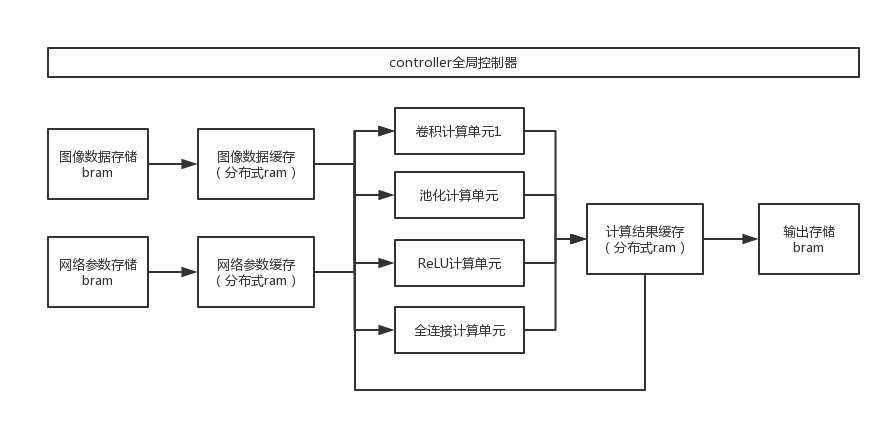

Figure 11：PL全局设计框架

设计中，PS端负责操作控制器并完成从软件到bram通过AXI总线的数据传输，等待控制器传回的中断信号，之后再将输出bram的数据取回产生结果标签，完成整个前向传播的分类过程。

由于bram读写有位宽限制，只能完成32位数据的串行传输，因此只用来和外部进行数据交互，硬件内部为了拓展位宽均使用分立式RAM存储中间结果和最终结果，因为每次计算只需要使用一个计算单元，因此片上的分立式RAM资源可以重复使用，只需要使用控制器给出数据分选操作信号即可。

### 前期准备

本次数据均采用8位定点数据格式，而给出的数据位十进制float小数，因此需要进行转化，依旧采用python进行转换。由于图像像素为0-255，8位整数可以满足要求，因此不需要进行规约；通过观察给出的网络参数，每组参数的数量级基本一致（如conv1的weight为10e-1，conv2的weight为10e-2），因此首先采用科学计数法表示数字，十进制中只取前三位并限制绝对值小于128，这样，将十进制数转化为\[-127,127\]，便可用8bit二进制表示，在给出结果后转化为十进制数并乘以相应的指数值即可。

至此，便完成了数据的预处理过程。

功能实现
--------

### 卷积计算模块

表格 8

| 接口         | 方向 | 功能概述                                                 |
|--------------|------|----------------------------------------------------------|
| clk          | I    | 时钟信号输入                                             |
| clken        | I    | 使能信号                                                 |
| data         | I    | 数据输入，矩阵按照一维格式并行输入                       |
| filterWeight | I    | 卷积核权重输入，单个卷积核一维并行，多个卷积核按顺序并行 |
| filterBias   | I    | 偏置系数输入，单个卷积核一维并行，多个卷积核按顺序并行   |
| result       | O    | 结果输出，矩阵一维并行输出                               |

卷积操作的设计中允许一次性输入多个卷积核并给出最终结果，为了提高数据通量，全部采用了并行输出，利用定长数据的特点，只要确定了数据个数就能够计算出对应的数据开始的位和结束的位，便能正确取出数据参与计算，因此全部并行数据输入的实现方式是可行的。而且，无论是PS端到bram函数bram到缓存都会消耗大量的时间，这个时间刚好可以用来完成一次大规模的数据运算，时钟延迟并不会在这里受到阻碍。

此模块内部多次实例化了ConvKernel模块，用来完成针对一个Kernel的在一个同样大小的数据矩阵的一次矩阵相乘计算，但支持多通道计算，方便卷积模块的层次化设计。

### ReLU计算模块

表格 9

| 接口   | 方向 | 功能概述                           |
|--------|------|------------------------------------|
| clk    | I    | 时钟信号输入                       |
| clken  | I    | 使能信号                           |
| data   | I    | 数据输入，矩阵按照一维格式并行输入 |
| result | O    | 结果输出，矩阵一维并行输出         |

ReLU函数的实现较为简单，根据公式：

=max\left(0,x\right))

遍历data的每个数字进行检查即可实现。需要注意的是，基于ReLU的这个特点，要求网络中的所有计算都是有符号计算。

### Max_pool模块

表格 10

| 接口   | 方向 | 功能概述                           |
|--------|------|------------------------------------|
| clk    | I    | 时钟信号输入                       |
| clken  | I    | 使能信号                           |
| data   | I    | 数据输入，矩阵按照一维格式并行输入 |
| result | O    | 结果输出，矩阵一维并行输出         |

最大值池化的实现方式和ReLU类似，结合助教给出的实现思路，按照Kernel大小进行遍历，只在结果数组中保留最大值，最终直接给出结果数组中的值就是整个Max\_pool层的输出。

### FullConnect全连接层设计

表格 11

| 接口   | 方向 | 功能概述                           |
|--------|------|------------------------------------|
| clk    | I    | 时钟信号输入                       |
| clken  | I    | 使能信号                           |
| data   | I    | 数据输入，矩阵按照一维格式并行输入 |
| Weight | I    | 权重矩阵输入，并行设计             |
| Bias   | I    | 偏置输入，并行设计                 |
| result | O    | 结果输出，矩阵一维并行输出         |

全连接层完成的操作就是一个矩阵向量乘法，继续采用之前卷积层的设计思路，将所有矩阵数据并行输入给模块，一次性计算出需要的结果进行输出。代码实现方面，借用了integer变量来统计部分和，实现纯逻辑的计算设计。

### Controller设计

控制器为状态机，负责传输和相应软件控制程序的中断信号，并按照状态转移驱动逻辑硬件进行计算。状态转移时序见Figure 12。考虑到bram的串行读写矩阵数据需要大量的时间，因此在数据写入缓存结束之后就开始下一次数据的读入，等待数据写入缓存的实现完成软件和硬件结果输出的数据交换，尽可能的保证存储器部件时刻处于读写状态，缩短计算时间。

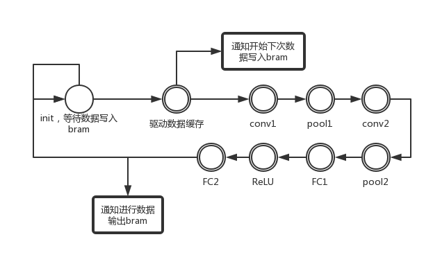

Figure 12：控制器状态机

设计分析与问题优化
------------------

### 单个部件的模拟仿真

为了保证单个逻辑部件的计算正确，进行了单个模块的仿真验证。

首先是卷积计算模块：

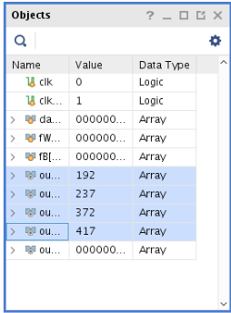

Figure 13：卷积模块仿真结果

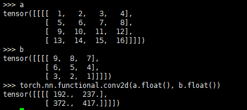

Figure 14：卷积计算结果对比

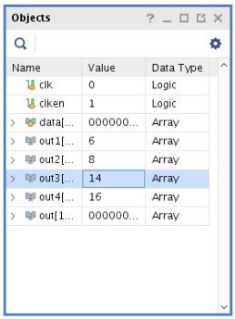

Figure 15：最大值池化仿真（输入矩阵保持一致）

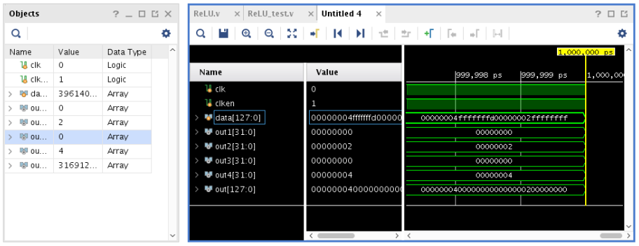

Figure 16：ReLU仿真结果

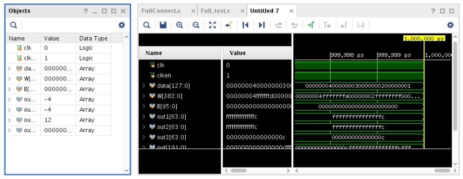

Figure 17：全连接仿真结果

Figure 18：全连接层计算对比

从上述结果可以看出，所有计算模块的实际均可给出正确结果。

### Block Design逻辑部件整合

为了和PS端相配合，在输入输出的bram处都采用AXI总线进行数据传输，根据需要封装了AXI Full和AXI Stream两种总线接口的Slave部件和Master部件用来连接PS和PL。 
按照之前的设计，数据存储使用bram，数据缓存使用分立式ram。由于时间关系，接下来的工作暂时还未完成。

### PS端软件设计

。

### 实验结果

。

实验总结与反思
--------------

这次实验遇到的问题首先是对神经网络的计算过程不熟悉，虽然之前自己搭建过深度模型，也训练过resnet、vgg等大型网络，但都是使用现有的Python库，没有深究过每层具体的实现方式。因此在设计开始之前，就花了大量的时间来详细探究网络中具体的计算方式和数据组织形式。在数据通路方面，因为这次需要大量的成批数据交互，需要使用AXI总线协议进行连续的数据传输，所以我还花了很多时间了解AXI总线协议。主要参考了：[ZYNQ基础系列（一） AXI总线通信](https://blog.csdn.net/long_fly/article/details/78619451)和[AXI总线的一些知识](https://blog.csdn.net/GoUpToTheSky/article/details/80286628)两篇博客，形成了我目前的设计。但因为时间紧迫，没来得及完成硬件部件整体实现。
